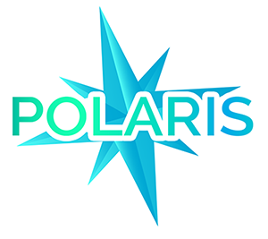

# polaris-logs

[](https://travis-ci.com/Enigmatis/polaris-logs)
[](https://www.npmjs.com/package/@enigmatis/polaris-logs)

Write your logs easily in a standardized manner!

Ever wanted your logs to look pretty, to contain all the data you need in order to monitor your system, and to be written in an extremely easy way? You can now do this, using this library.

### LoggerConfiguration

Through this interface you should set the following configuration to the `PolarisLogger`:

-   **loggerLevel** (_LoggerLevel_) - The level the logger is listening on, can be one of the following levels: `fatal` /
    `error` / `warn` / `info` / `debug` / `trace`.
-   **logstashConfigurations** (_LogstashConfiguration[] - optional_) - Through this property you can set multiple logstash
    hosts, ports and protocols (**Notice that you can use `TCP`/`UDP` or `DYNAMIC` for each logstash config**).
    Use `DYNAMIC` to make polaris-logs decide which protocol to use according to the size of the log.
-   **writeToConsole** (_boolean - optional_) - Determines if the logger should write the logs to the console.
-   **writeFullMessageToConsole** (_boolean - optional_) - Set this property to `true`, if you decide to write full
    detailed logs to the console, since only the `timestamp` accompanied by the `log level`, `message` and
    `throwable` will be written by default.
-   **logFilePath** (_string - optional_) - If provided, the logs will be written to the specified path.
-   **dailyRotateFileConfiguration** (_DailyRotateFileConfiguration - optional_) - If you are interested in daily log file
    instead of just **one** log file, see the configuration section below. It creates a log file for each day. Those daily
    log files deleted after `X` days after being created. **If provided, it ignores the logFilePath property.**
-   **customTransports** (_Transport[] - optional_) - Array of custom transports you can provide to the winston logger.

### DailyRotateFileConfiguration

-   **directoryPath** (_string_) - The directory path, where the daily files will be located.
-   **fileNamePrefix** (_string_) - The current date in the format of `DD-MM-YYYY` will be added to the name prefix.
-   **fileExtension** (_string_) - The extension of the log file (without the dot).
-   **numberOfDaysToDeleteFile** (_number - optional_) - Number of days till old log files will be deleted, default is 30
    days.

### ApplicationProperties

This interface represents the application configurable log properties.

Those properties are:

-   id
-   name
-   version
-   environment
-   component

### PolarisLogProperties

This interface represents the log properties that will be logged through the `PolarisLogger`.

Those properties are:
- `throwable`: The throwable object, if an error occurred. *any | Optional*
- `elapsedTime`: You can provide an elapsed execution time of the operation. *number | Optional*
- `logId`: You can provide a unique log id for each log. *string | Optional*
- `customProperties`: You can provide custom properties, and it will be piped to the log. *any | Optional*
- `response`: The response sent to the client. *any | Optional*
- `messageId`: A unique identifier of the request/operation process. Something like a transaction id of a process. *string | Optional*
- `recordId`: A unique identifier of the log(generated automatically). *string | Optional*
- `eventKind`: The kind of event that happened. An event id. *string | Optional*
- `eventKindDescription`: A description of the event kind that occurred. *EventKindDescription | Optional*
- `reality`: You can provide The reality which the operation took place in. *Reality | Optional*
- `request`: The request sent by the client. *Request | Optional*
- `entity`: You can provide an entity of your query you want to record. Note that in case you log both entity and entities properties, entity will merged into entities and only entities will be logged. *Entity | Optional*
- `entities`: You can provide entities of your query you want to record. Note that in case you log both entity and entities properties, entity will merged into entities and only entities will be logged. *Entity[] | Optional*
- `upn`: The user identifier that executed the operation. *string | Optional*
- `ip`: The ip address of the server that the request came from. *string | Optional*
- `host`: The server/container name where the event occurred. *string | Optional*
- `groupId`: The attributes that defines the relation between the entities to the event that occurred. *GroupId | Optional*

### PolarisLogger

This class interacts with the actual winston logger and responsible for logging the properties that was provided to him.

### Example

```TypeScript

import {
    ApplicationProperties,
    LoggerConfiguration,
    LoggerLevel,
    LogstashConfiguration,
    LogstashProtocol,
    PolarisLogger,
} from '@enigmatis/polaris-logs';

const appProps: ApplicationProperties = {
    id: 'p0laris-l0gs',
    name: 'polaris-logs',
    version: 'v1',
    environment: 'environment',
    component: 'component',
};

const logstashConf: LogstashConfiguration[] = [
    {
        host: '127.0.0.1',
        port: 3000,
        protocol: LogstashProtocol.TCP,
    },
    {
        host: '8.8.8.8',
        port: 6000,
        protocol: LogstashProtocol.UDP,
    },
    {
        host: '127.0.0.1',
        port: 3000,
        protocol: LogstashProtocol.DYNAMIC,
    }
];

const logConf: LoggerConfiguration = {
    loggerLevel: LoggerLevel.TRACE,
    logstashConfigurations: logstashConf,
    writeToConsole: true,
    writeFullMessageToConsole: true,
    // logFilePath: 'D:\\example.txt',
    dailyRotateFileConfiguration: {
        directoryPath: 'D:\\',
        fileNamePrefix: 'polaris',
        fileExtension: 'txt',
        numberOfDaysToDeleteFile: 60,
    },
};

const logger = new PolarisLogger(logConf, appProps);

logger.fatal('fatal message', { elapsedTime: 500, eventKind: 'foo' });
logger.error('error message', { elapsedTime: 15000, throwable: new Error('oops') });
logger.warn('warn message');
logger.info('info message');
logger.debug('debug message');
logger.trace('trace message');

```

For any additional help and requests, feel free to contact us :smile:
